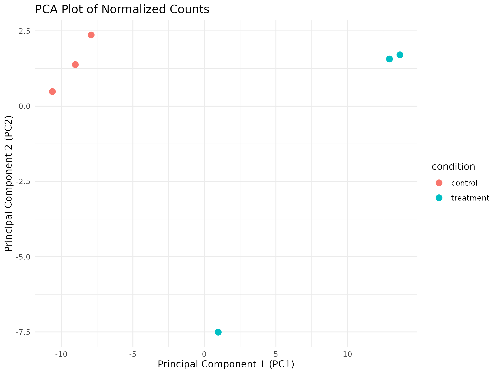
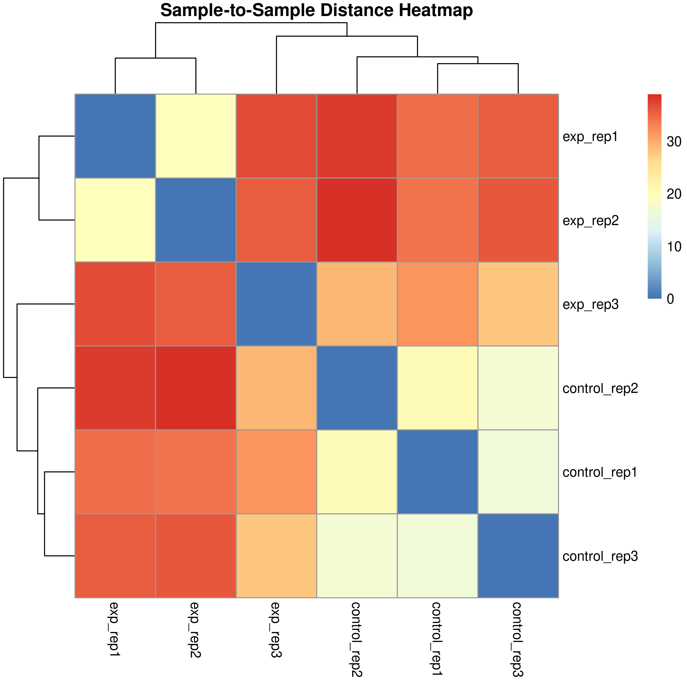
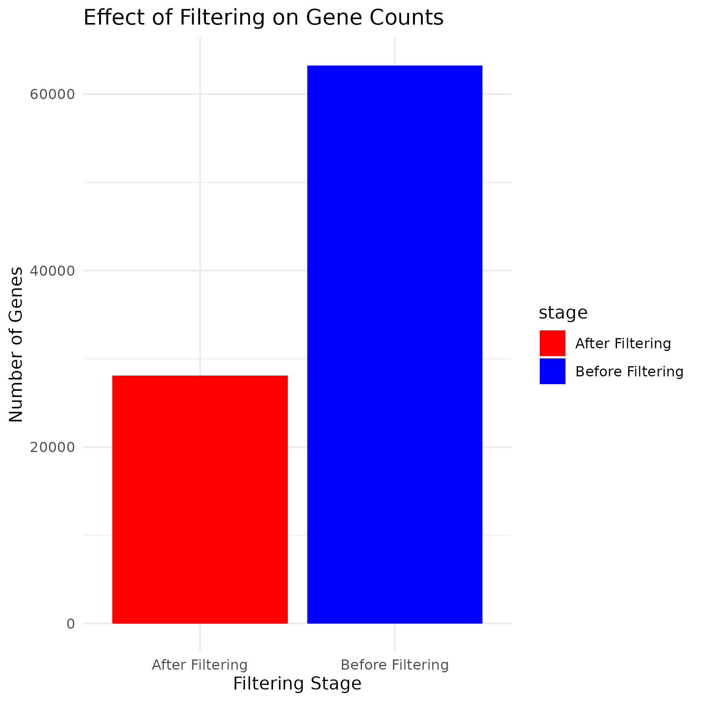

# RNAseq-nf-pipeline

This repository contains a modular, reproducible RNA-seq analysis pipeline built with [Nextflow](https://www.nextflow.io/). It automates key steps from raw count processing to differential expression analysis and pathway enrichment, leveraging tools like DESeq2, PCA visualization, and FGSEA.

---

## 📁 Repository Structure

```
RNAseq-nf-pipeline/
├── main.nf                  # Main Nextflow pipeline script
├── nextflow.config          # Pipeline configuration file
├── modules/                 # Custom Nextflow modules
├── envs/                    # Conda environment definitions
├── bin/                     # Helper scripts
├── docs/                    # Documentation and reports
├── metadata.csv             # Sample metadata
├── filtered_counts.csv      # Filtered count matrix
├── fgsea_results.csv        # FGSEA enrichment results
├── top_10_genes.csv         # Top 10 differentially expressed genes
├── significant_gene_symbols.txt  # Significant gene symbols list
├── verse_concat.csv         # Concatenated data for analysis
├── pca_plot.png             # PCA plot image
├── sample_distance_heatmap.png  # Sample distance heatmap image
├── filtering_effect.png     # Filtering effect visualization
├── fgsea_enrichment_plot.png  # FGSEA enrichment plot image
├── Project-1.Rmd            # R Markdown report
└── README.md               
```

---

## Getting Started

### Prerequisites

- [Nextflow](https://www.nextflow.io/)
- [Conda](https://docs.conda.io/en/latest/)
- [Docker](https://www.docker.com/) or [Singularity](https://sylabs.io/singularity/) (optional for containerized execution)

### Installation

1. Clone the repository:
   ```bash
   git clone https://github.com/vassan1h/RNAseq-nf-pipeline.git
   cd RNAseq-nf-pipeline
   ```

2. Set up the Conda environment:
   ```bash
   conda env create -f envs/environment.yml
   conda activate rnaseq-nf
   ```

### Running the Pipeline

```bash
nextflow run main.nf 
```

This command will execute the pipeline using the provided metadata and count files, outputting results to the `results/` directory. Everything is well documented and described.

---

## Pipeline Overview

The pipeline performs the following key steps:

1. **Data Input**: Reads in sample metadata and raw count matrices.
2. **Quality Control**: Generates QC metrics and visualizations.
3. **Filtering**: Applies thresholds to filter low-expression genes.
4. **Normalization**: Normalizes count data for downstream analysis.
5. **Differential Expression Analysis**: Identifies differentially expressed genes using DESeq2.
6. **Visualization**: Creates PCA plots, heatmaps, and volcano plots.
7. **Pathway Enrichment**: Performs FGSEA for pathway enrichment analysis.

---

## Example Visualizations

  
*Principal Component Analysis (PCA) plot showing sample clustering.*

  
*Heatmap depicting sample-to-sample distances.*

  
*Visualization of gene filtering effects.*


---

## Reference Dataset

The pipeline utilizes the following reference dataset:

- [The type 1 diabetes gene TYK2 regulates β-cell development and its responses to interferon-α](https://www.nature.com/articles/s41467-022-34069-z)

---

## 👨‍🔬 Author

**Vassanth M.**, M.S. in Bioinformatics  

---

